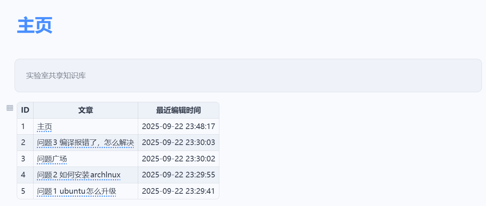

[English](./README_en_US.md)

# 思源笔记插件——最近更新文档列表

## 描述

当我们想要使用思源笔记建立多人共享的知识库时，当文档数量越来越多，其他人很难知道知识库中新添加了什么内容。为了方便查看，我们设计了简单的插件，能够统计当前笔记本中所有的文档，根据修改时间排序，列成一个表放在主页中，方便大家查看知识库的最近更新文章，不让好文章被埋没~

## 使用方法

在你需要插入表格的地方，输入`/crzjgxlb`

插入之后，便可得到如下表格：

打开设置后，可以对表格长度进行调整：

## 下一步计划

- [x] 能够自动生成静态表格
- [ ] 能够插入动态的表格，表格上的文档、时间等会动态的发生变化