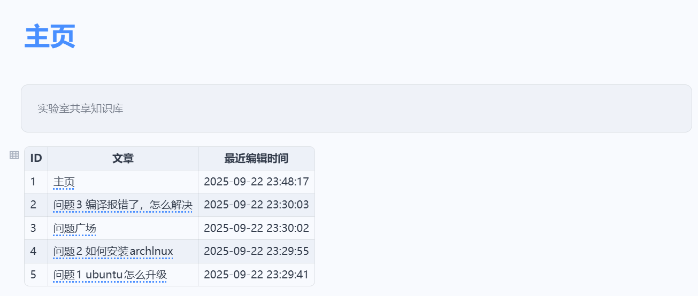
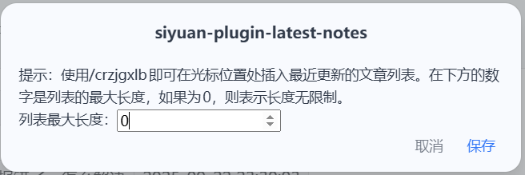

[中文](https://github.com/siyuan-note/plugin-sample/blob/main/README.md)

# SiYuan Note Plugin – Recently Updated Documents List

## Description

When using SiYuan Notes to build a multi-user shared knowledge base, it becomes difficult for others to know what new content has been added as the number of documents grows.  
To make this easier, we designed a simple plugin that scans all documents in the current notebook, sorts them by modification time, and renders the result as a table on the home page.  
This way everyone can quickly see the latest updates and no good article will be buried.

## Usage

Wherever you want to insert the table, type `/crzjgxlb`.

After insertion you will get the following table:

Open the settings to adjust the table length:

## Next Steps

- [x] Auto-generate static table  
- [ ] Support dynamic table whose documents and timestamps update automatically